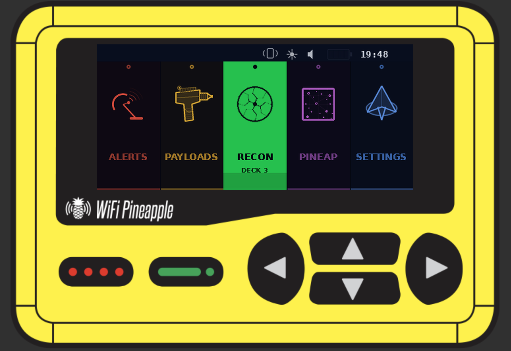
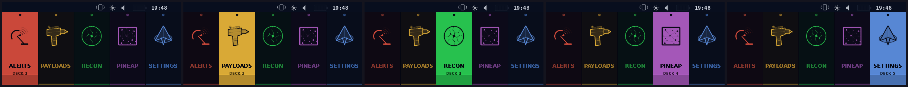
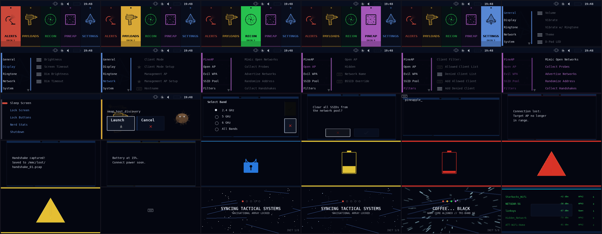
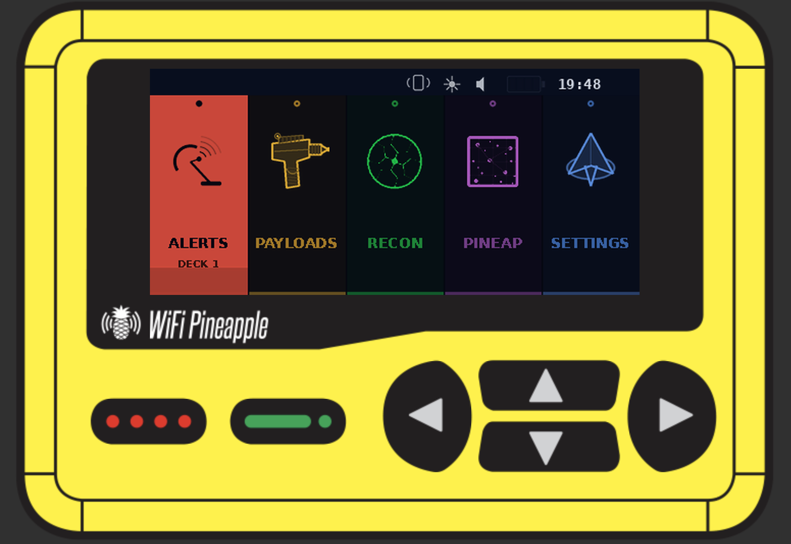
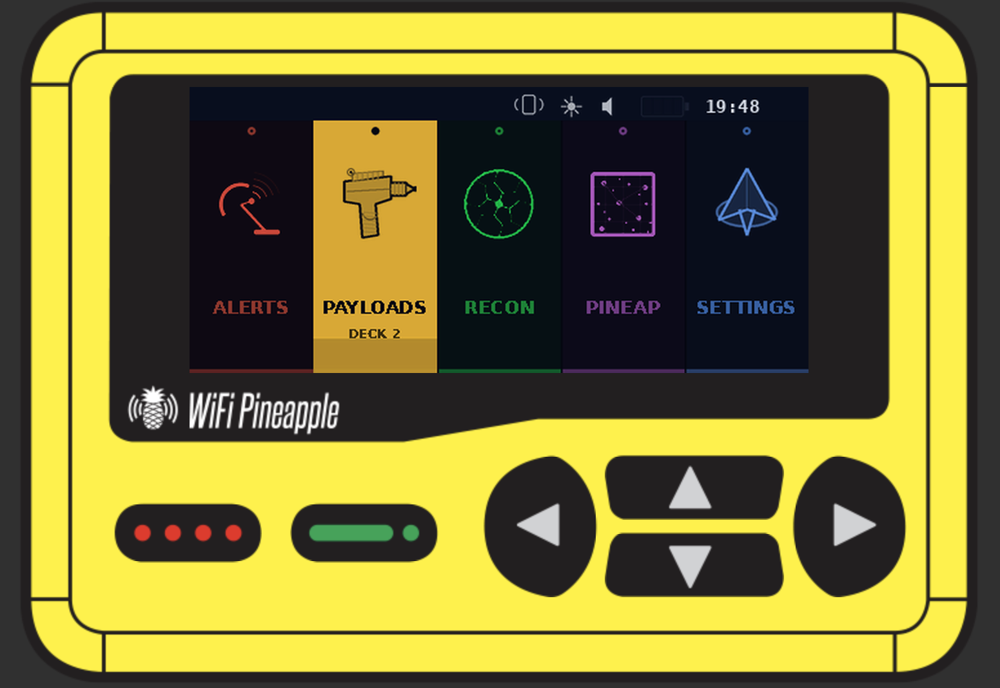

# PCARS

**Pineapple Computer Access Retrieval System**



A dark, utilitarian theme for the WiFi Pineapple Pager. Class 9 probe aesthetics meets duotronic interface design — built for away missions where stealth matters more than style.

## Screenshots

### Dashboard — All Five Stations



### Full Theme Overview



### On Device

| Alerts | Payloads | Recon |
|--------|----------|-------|
|  |  |  |

## Author

**superbasicstudio**

- [superbasic.studio](https://superbasic.studio)
- [GitHub](https://github.com/superbasicstudio)

## Description

Inspired by the bridge consoles of a certain Galaxy-class starship — dark structural frames on near-black backgrounds, with surgical accent lighting that would make any chief engineer proud. Each section runs its own color frequency: red alert for threats, amber for tactical operations, green for long-range scanning, magenta for subspace interference, and cool blue for ship's systems. The LCARS-adjacent layout puts everything within reach without cluttering the viewscreen.

All 187 assets are programmatically generated at 3x resolution and downscaled with LANCZOS anti-aliasing — because if you're going to replicate something at the molecular level, you want clean transporter patterns.

## Design Specs

- **Hull plating:** Deep navy-black (#040610) — minimal EM signature
- **Structural ribs:** Dark navy-blue bars with bright blue edge illumination
- **Deflector accents:** Electric blue edge glow on all frame elements
- **Targeting lock:** White highlight on selected elements, section accent on dashboards
- **Deck color coding:** Red (alerts), amber (payloads), green (recon), purple (PineAP), blue (settings) — each section operates on its own frequency
- **Bridge layout:** Horizontal-arc dashboard — all five stations visible at once
- **Bulkhead consistency:** Uniform framing across all 113 component screens

## Stardate Compatibility

Developed for WiFi Pineapple Pager firmware **1.0.7** (OpenWrt 24.10.1 base, theme framework 0.5).

## Docking Procedure

Transfer the `pcars` directory to your Pager's cargo bay:

```
scp -r pcars/ root@172.16.52.1:/mmc/root/themes/
```

Or beam it over via the Pager web UI theme manager.

## Replicator Protocol

The `generate_pcars_assets.py` script regenerates all 187 PNG assets from source parameters using Python + Pillow. Not deployed to the device — runs on your workstation.

```
pip install Pillow
python3 generate_pcars_assets.py
```

Useful for modifying the color palette, adjusting layouts, or creating variant themes without hand-editing individual assets.

## Known Anomalies

- Font rendering is hardcoded in the Pager firmware — no typeface customization available at this time
- Theme framework version 0.5 — the spec may shift between firmware updates. Recalibrate accordingly.

## License

Community theme for the Hak5 WiFi Pineapple Pager.
Subject to the [Hak5 Software License Agreement](https://hak5.org/license).
